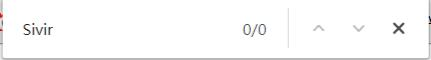
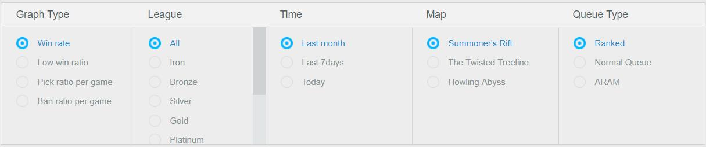
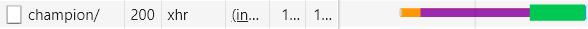
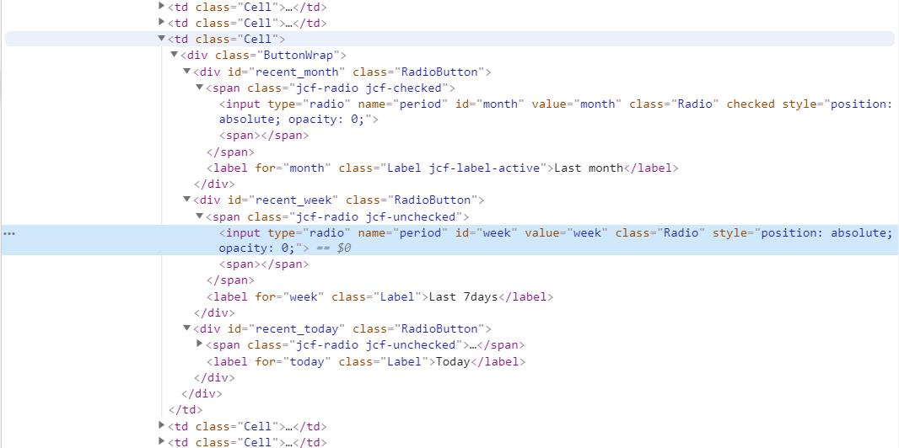
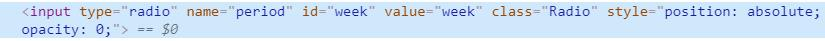

Have you met this problem? When you are going to crawl down some data from a website, you find nothing in the source code? When searching on the search engines, you may encounter the word "ajax". 

According to Wikipedia, ajax is a web technologies on the client side to create asynchronous web applications. It means that the web page can load the data without refresh the whole page.

I will walk through the path that I crawl ajax data. Hope this can inspire you when designing your own program.

## Follow the Common Way
My goal is to crawl down the op.gg ["Game Stat by Champion"](https://www.op.gg/statistics/champion/) page's data.

### Check the Source Code
First, open Chrome, press `ctrl+U` to callout the source code.

We try to search the first champions' name "Sivir". 



There is no "Sivir" in the source code. That means the website used some technique to load the data after the page is loaded.

It's now to take out our most powerful tool -- Chrome DevTools

### Use Chrome DevTools 
Chrome DevTools is a set of web developer tools built in the Google Chrome browser. DevTools can help us analyse the website's structure.

#### Network
We notice that there's some query buttons above the chart.



The network page enables us to monitor all the queries and links that is activate after we turn the DevTools on. So we callout the network page and click those query buttons. We get this: [https://www.op.gg/statistics/ajax2/champion/](https://www.op.gg/statistics/ajax2/champion/)



We clicked it, found data in it. But our job is not done yet.

No matter what button we clicked, we always get the same url, the same data.

It seems that we missed some query values.

It's time for elements.

#### Elements
In the elements, find where the buttons are.



We can easily find that there's several "Cell" td class and "ButtonWrap" div class in each "Cell" class.

Look inside the “RadioButton" class, we can find the query values.



"name" is the query name, in this case it is "period", and "value" is the query value, in this case it is "week".

So we can get an url [https://www.op.gg/statistics/ajax2/champion/period=week](https://www.op.gg/statistics/ajax2/champion/period=week) and it works.

Look through all "Cell" class and then we can get all the query names and query values. Then we can get all the data.

## Conclusion

The way to get data from ajax loading page is:```
    Search the source code.
    Activate query and monitor connection using Network
    Inspect Elements to get query names and values```