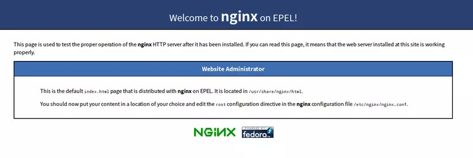

This article is about my way to deploy my own flask app on cloud.  
I use the service provided by Tencent Cloud, which uses CentOS 7.2 as the operating system of the CVM.
I use gunicorn to deploy the my flask app and use nginx to do reverse proxy.

```
Install python3 and set symbolic links
Create virtual environment
Install and configure Nginx
Install and configure gunicorn
```
## Install Python3
CentOS 7.2 uses python 2.7.5 to support the "yum" command. So what we have to do is:
```
Install Python3
Set default python version to 3
Set default python version of yum to 2
```
### Preinstall Packages
```
yum install gcc gcc-c++  # C compiler that used to compile python
yum install make  # C make library
yum install -y openssl openssl-devel openssl-static  # SSL support package
yum install bzip2-devel  # decompression support package
yum install expat-devel  # XML document resolve package
yum install gdbm-devel  # gdbm database library
yum install readline-devel  # Auto complete support package
yum install sqlite-devel  # sqlite support package
yum groupinstall -y "Development tools"  # install development tools
```
### Install
I choose python version 3.6.4 because it is stable.
Download
```
wget https://www.python.org/ftp/python/3.6.4/Python-3.6.4.tgz
```
Decompress
```
tar -zxvf Python-3.6.4.tgz
```
Change directory
```
cd Python-3.6.4
```
Configure and Install
```
./configure prefix=/usr/local/python3
make && make install
```
### Create symbolic links for python and pip
```
ln -s /usr/local/python3/bin/python3 /usr/bin/python
ln -s /usr/local/python3/bin/pip3 /usr/bin/pip
```
-s: for symbolic links  
/usr/local/python3/bin/python3: source directory  
/usr/bin/python: target directory  

So now when you type python, you'll call python3, and python2 for python2.  

You can call `python -V` and `python2 -V` to check that.  

Because yum still needs python2, we need to change yum's configuration file.  

Type `ls -ol yum*` to find the configuration file.

Do the following change to all the file listed:

`#!/usr/bin/python ` --> `#!/usr/bin/python2`

You may use vi editor `vi yum  (vi+directory)` to edit them.

## Virtual Environment
When using two different version of the same package, virtual environment can prevent you from keeping installing can uninstalling the packages.  

### Install virtualenv
`pip install virtualenv` to install

### Create virtual environment
```
/usr/local/python3/bin/virtualenv  -p /usr/bin/python3 venv
```
/usr/local/python3/bin/virtualenv: the directory of the virtualenv package
/usr/bin/python3: the base of your virtual environment
venv: the name of the virtual environment

This command will create a virtual environment under the current directory.  

`source venv/bin/activate` activate the virtual environment, venv is the name of your virtual environment

`deactivate` exit the current virtual environment

## Install Python Packages
use `pip install xxx`, xxx is the package you want to install

`pip install -r requirement.txt` when you have all your requirement in the requirement.txt file

To generate requirement.txt, `pip freeze > requirements.txt` in your own computer

## gunicorn
### Install
When the virtual environment is activate, run `pip install gunicorn`

### Start the service
```
gunicorn -w 4 [-D] -b 127.0.0.1:8000 wsgi:application
```
-w: the number of progress you want gunicorn to start
-D: start the service background
-b: bind your service to the certain IP, you should put tour LAN IP with the port you want to specify here.
wsgi: the manage filename of your flask app
application: the variable name in your flask app

## Nginx
### Install Nginx
```
yum install nginx
```
After installation, use `rpm -ql nginx` to check the installation directory.

commands of Nginx
```
service nginx start

service nginx stop

service nginx restart

service nginx reload # reload the service after changing the configuration file
```
Now you can see the Nginx welcome page when you type in your WAN IP in your own brower.

<!--  -->

### Change Configuration File
The configuration file is located in `/etc/nginx/nginx.conf`

use vi editor to edit `vi /etc/nginx/nginx.conf`

change the "server" section to the following

```
server {
        listen 80;  # the port you want Nginx to listen
        server_name "the url of your website";

        location / {
                proxy_pass "the LAN and port you specify in gunicorn";
                proxy_set_header Host $"the port you specify in gunicorn";
                proxy_set_header X-Forwarded-For $proxy_add_x_forwarded_for;
        }
}
```

Finally, `service nginx reload` to end config

## Kill Process When Something Happened
`pstree -ap | grep gunicorn` to show processes associate with gunicorn
`kill -9 xxx` "xxx" is the pid showed above, kill the processes
`netstat -ntlp` to show all the ports that is occupied


