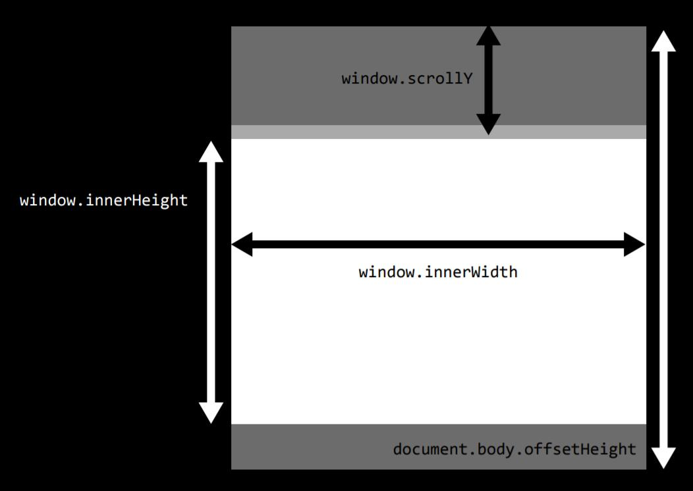

<iframe src="//player.bilibili.com/player.html?aid=58975882&cid=102776550&page=3" scrolling="no" border="0" frameborder="no" framespacing="0" allowfullscreen="true" width="100%" height="500px"> </iframe>

<iframe src="//player.bilibili.com/player.html?aid=58975882&cid=102776419&page=4" scrolling="no" border="0" frameborder="no" framespacing="0" allowfullscreen="true" width="100%" height="500px"> </iframe>

## Two Ways of Adding JS in HTML

### Script Tag

```en
<script>
    your JS code
</script>
```

### Seperate File

```en
<script src="xxx.js"></script>
```

**NOTE:** JS code can be added everywhere in the HTML file, not only in the &lt;head&gt; tag. HTML file is loaded from top to bottom. Be careful because the location of your JS code may cause bugs in your webpage.

## Call the JavaScript Code

### Call in the HTML

```en
<button event_name="function_name">xxx</button>
```

### Call in the JS file

Use querySelector.

## DOM(Document Object Model) Manipulation

### querySelector

Select the first element in the document.

- `document.querySelector('tag')`
- `document.querySelector('#id')`
- `document.querySelector('.class')`

querySelector returns an object.

`object.innerHTML` is the content of the element.

So `object.innerHTML` = xxx can change the content of the element to xxx.

You can also modify the style by `object.style.xxx`

**NOTE:** If you want to select every element in the document, use querySelectorAll, it will return an array of object.

### addEventListener

`document.addEventListener("DOMContentLoaded", function)`

the function you passed in will be executed after all the DOM content loaded.

Used to fix the problem that JS code loaded at the front of the HTML document.

### Arrow Functions

`x => x*2`

Takes the left of the arrow and output the right of the arrow.

### Local Storage

Local storage is a place where you can save the data locally forever. It's about 5M. You can use this feature to save your data so that it won't change when the user refresh the page.

Command | Purpose
:-: | :-:
`localStorage.setItem("temp", arr)` | Save arr locally to "temp"
`localStorage.getItem("temp")` | Get the data in "temp"
`localStorage.removeItem("temp")` | Remove "temp"
`localStorage.clear()` | Clear local storage

### Window

Property | Description
:-: | :-:
`window.innerHeight` | Returns the height of the window's content area
`window.innerWidth` | Returns the width of the window's content area
`window.scrollY` | Returns the pixels that the current document has been scrolled from the top of the window
`document.body.offSetHeight` | Returns the height of the whole document



## Animation

### CSS Animation

#### Keyframe

In &lt;style&gt; tag.

##### Code

```en
@keyframes grow {
    0% {
        left: 0%;
        color: red;
        font-size: 14px;
    }
    50% {
        left: 50%;
        color: blue;
        font-size: 20px;
    }
    100% {
        left: 0%;
        color: green;
        font-size: 26px;
    }
}
    .example {
        position: relative;
        animation-name: grow;
        animation-fill-mode: forwards;
        animation-duration: 3s;
        animation-iteration-count: infinite;
    }
}

<p class="example">Hello!</p>
```

##### Effect

<style>
@keyframes grow {
    0% {
        left: 0%;
        color: red;
        font-size: 14px;
    }
    50% {
        left: 50%;
        color: blue;
        font-size: 20px;
    }
    100% {
        left: 0%;
        color: green;
        font-size: 26px;
    }
}
    .example {
        position: relative;
        animation-name: grow;
        animation-fill-mode: forwards;
        animation-duration: 3s;
        animation-iteration-count: infinite;
    }
}
</style>

<p class="example">Hello!</p>

### SVG

SVG is the abbreviation of Scalable Vector Graphics
SVG is resolution independent, the resolution of it won't change when zoom in.

The following code is based on the d3.js library

#### Draw Elements

<script src="https://cdnjs.cloudflare.com/ajax/libs/d3/5.9.7/d3.min.js"></script>

```en
<svg id="svgexample1" stylt="width:100%; height:800px"></svg>

<script>
const svg = d3.select('#svgexample1');

svg.append('circle')
    .attr('cx', 200) (center x)
    .attr('cy', 75)  (center y)
    .attr('r', 50)   (radius)
    .style('fill', 'red');   (filled color)
</script>
```

<svg id="svgexample1" stylt="width:100%; height:800px"></svg>

<script>
const svg = d3.select('#svgexample1');

svg.append('circle')
    .attr('cx', 200)
    .attr('cy', 75)
    .attr('r', 50)
    .style('fill', 'red');
</script>

#### Animation

```en
<svg id="svgexample2" stylt="width:100%; height:800px"></svg>

<script>
const svg = d3.select('#svgexample2');

const c = svg.append('circle')
             .attr('cx', 200)
             .attr('cy', 75)
             .attr('r', 25)
             .style('fill', 'red');

c.transition()
 .duration(1000)
 .attr('cx', 500)
 .style('fill', 'green')
 .attr('r', 50)

</script>
```

The Code above will draw a red circle whose radius is 25, then the circle will move to the right while becomming bigger and turning ino green.
