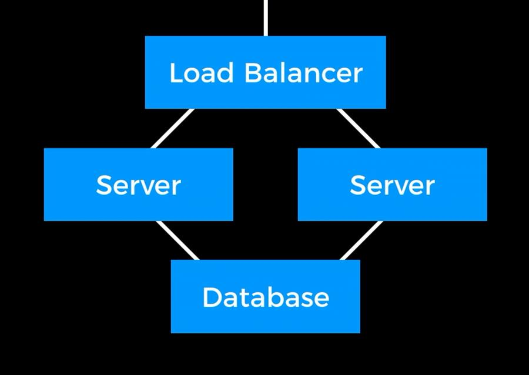
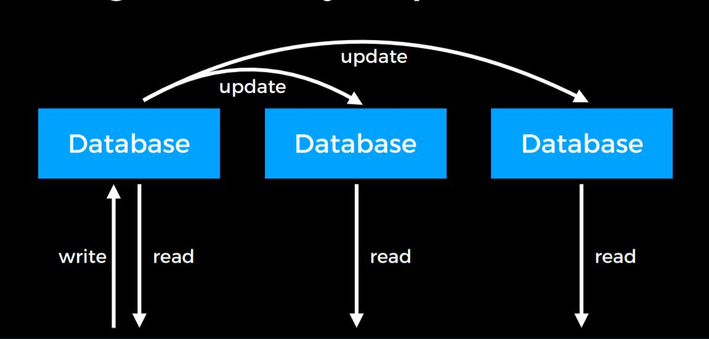
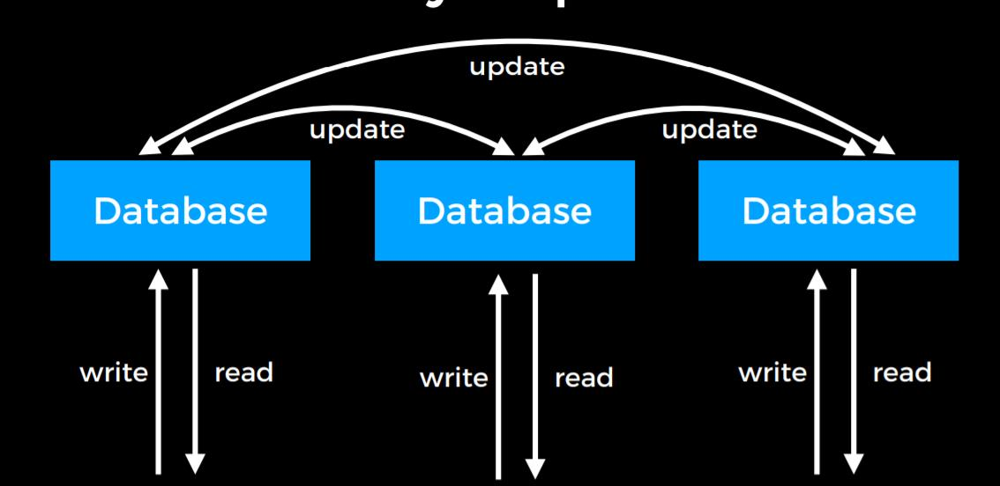
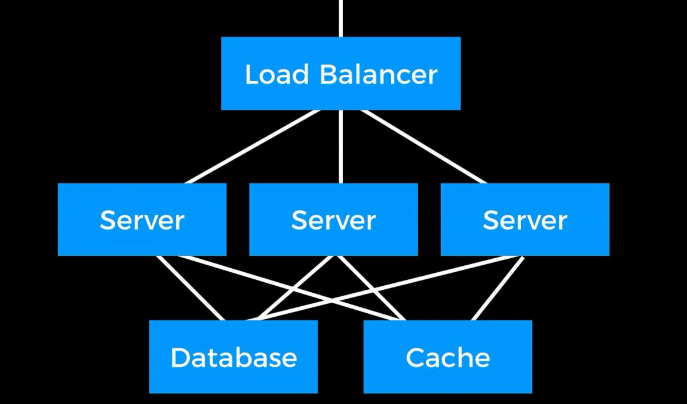

<iframe src="//player.bilibili.com/player.html?aid=58975882&cid=102776726&page=10" scrolling="no" border="0" frameborder="no" framespacing="0" allowfullscreen="true" width="100%" height="500px"> </iframe>

## Security

### Git

Open souce has a trade-off, on one hand, everyone can see the source code so that everyone can help fix the bugs, on the other hand, everyone can look for potential vulnerabilities and then take advantage of it.

Also, your git commit history is going to store the entire history, so if you make a commit that accidentally include your credentials. If you delete them in the later commit, the credentials are still there. That's the potential risk. Be careful about that.

### Flask

So when you are building your web application, you can save your key in the Environment Variable.

In flask, you can set your secret key like this:

`app.config["SEVRET_KEY"] = os.environ_get("SECRET_KEY")`

The way to add environment variable is:
`export SECRET_KEY=xxxxxxxxx` (for Mac)
`set SECRET_KEY=xxxxxxxxx` (for Windows)

### SQL

#### Store Passwords

Don't directly store the password in the database.

Instead of directly store the password in the data base, you should store the hash version of password in the database.

#### SQL Injection

Wherever you are making SQL queries, either use a library or do the escape yourself to prevent you from SQL injection attack.

### JavaScript

Cross-Site Scripting:

Attackers will inject client-side scripts into web pages viewed by other users.

e.g. In Flask

If your code is like this:

```en
@app.route('/<string:name>')
def hello(name):
    return "Hello,"+name
```

When a viewer typed in `/<script>alert('hi')</script>`

An alert 'hi' will be raised.

This can also happens when you have a form for a user to submit.

**Solution:**
For url inject, check "<" and ">" whenever you receive a request.

For form submit, add CSRF token.

CSRF token is a secret, user-specific token in all form submissions.

## Scalability

### Benchmarking

A test to see how many user can a server support.

**Solotions:**

- Vertical Scaling: Get a bigger server
- Horizontal Scaling: Get more server

#### Problems for Horizontal Scaling

- How does the server communicate with each other?
- Which server does the user go to when the come to the website?

Solution: add a load balancer

### Load Balancing

Methods to assign connections:

- Random Choice
- Round Robin
- Fewest Connections

### Session-Aware Load Balancing

User may store some information on the server, what happen when he goes to another server next time?

So you need to store the session information. There are three ways to store them.

- Sticky Sessions (User always go to the same place)
- Sessions in Database
- Client-Side Sessions

### Autoscaling

Dynamically add servers to the Load Balancer.

Use some sort of ping or heartbeat to make sure when a server is down, the load balancer knows.

### Scaling Databases



But there's another problem raised, a single database can only communicate with a limit number of connections.

We use Database Replication to solve this problem

### Database Replication

#### Single-Primary Replication



In single-primary replication, you can read from a number of database but can only read from one database.

The you update other database from the writable database.

This only solve the read problem but does not solve the write problem.

#### Multi-Primary Replication



Multi-Primary Replication solve the problem of read and write at the same time, but raise another problem: what if there's conflicts?

There can be a Git like system to solve this.

### Caching

If we can store the data in some other place, we may not need to access the data base so often.

#### Client-Side Caching

##### Cache-Control

Inside the HTTP headers, there's a header called "Cache-Control", where you can set the time of the data cache in the computer.

`Cache-Control: max-age=86400` means that if the user refresh the page less than 86400s after the first request, the browser will not make a request and use the cache data.

##### ETag

ETag is a tag that is unique for each version of a big file on the server.

When a big file is sent to the client, the ETag will be attached.

When a browser make a request with the ETag, the web applictaion will not send it again if it is the latest version of that file.

#### Server-Side Caching



When there's request to the database, the web applictaion will save a copy of it and the request inside of Cache, so the server can get the data more quickly in the cache and make less requests to the database.
